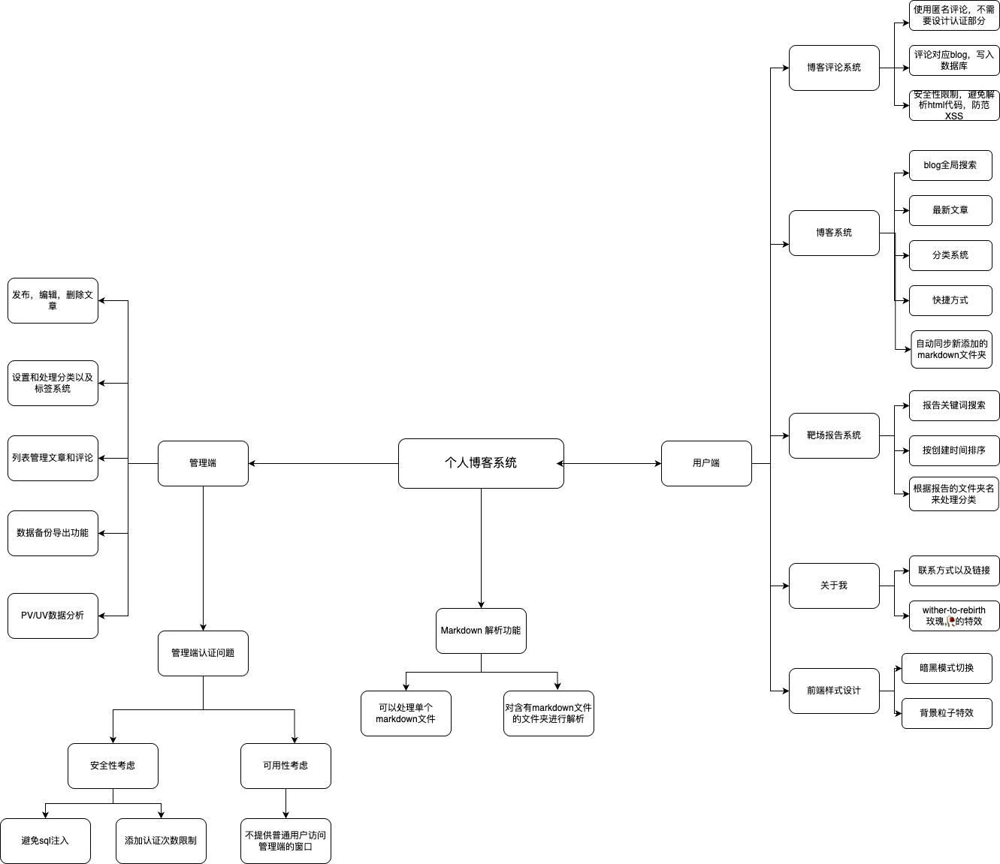

# Laravel 博客&报告系统

一个基于Laravel的现代化个人博客和渗透测试报告系统，专为网络安全爱好者和技术博主打造。



## 🚀 项目简介

这是一个功能强大的Laravel应用程序，集成了博客发布、CTF报告展示、数据分析等多种功能。项目采用现代化的设计理念，提供直观的用户界面和完善的管理后台。

### ✨ 主要特色

- **🔥 双重内容系统**：博客文章 + 渗透测试报告
- **📝 Markdown支持**：原生支持Markdown编写和渲染
- **💬 评论互动**：完整的评论系统，支持审核和管理
- **📊 数据分析**：实时访问统计和详细分析报告
- **🎨 现代界面**：响应式设计，优雅的用户体验
- **🔧 强大后台**：功能完备的管理界面
- **🔍 智能搜索**：全文搜索，快速定位内容
- **📱 移动友好**：完美适配各种设备
- **🚄 性能优化**：缓存机制，快速加载
- **💾 备份管理**：自动化数据备份功能

## 🛠 技术栈

### 后端技术
- **Laravel 11** - PHP现代化框架
- **PHP 8.2+** - 最新PHP版本
- **SQLite** - 轻量级数据库
- **League CommonMark** - Markdown处理
- **HTML-to-Markdown** - HTML转换

### 前端技术
- **原生JavaScript** - 现代ES6+语法
- **CSS3** - 响应式设计和动画
- **Chart.js** - 数据可视化
- **现代化UI组件** - 自定义组件库

### 开发工具
- **Laravel Pint** - 代码格式化
- **PHPUnit** - 单元测试
- **Vite** - 前端构建工具

## 📋 系统要求

- **PHP**: 8.2 或更高版本
- **Composer**: 最新版本
- **Node.js**: 16+ (可选，用于前端编译)
- **SQLite**: 3.0+ (或其他数据库)
- **Web服务器**: Apache/Nginx
- **扩展**: OpenSSL, PDO, Mbstring, Tokenizer, XML, Ctype, JSON

## 🚀 快速部署

### 1. 克隆项目
```bash
git clone https://github.com/your-username/laravel_report_system.git
cd laravel_report_system
```

### 2. 安装依赖
```bash
# 安装PHP依赖
composer install

# 安装Node.js依赖 (可选)
npm install
```

### 3. 环境配置
```bash
# 复制环境配置文件
cp .env.example .env

# 生成应用密钥
php artisan key:generate

# 创建SQLite数据库文件
touch database/database.sqlite
```

### 4. 配置数据库
编辑 `.env` 文件：
```env
DB_CONNECTION=sqlite
DB_DATABASE=/absolute/path/to/database/database.sqlite
```

### 5. 运行迁移
```bash
php artisan migrate
```

### 6. 创建存储目录
```bash
# 创建博客和报告目录
mkdir -p storage/blog
mkdir -p storage/reports
mkdir -p storage/reports/Hackthebox-Walkthrough

# 设置权限
chmod -R 755 storage
chmod -R 755 bootstrap/cache
```

### 7. 启动服务
```bash
# 开发环境
php artisan serve

# 生产环境 (配置Web服务器指向public目录)
```

### 8. 访问应用
- **前台首页**: http://localhost:8000
- **管理后台**: http://localhost:8000/admin
- **首次访问**: 访问后台进行初始设置

## 🎯 核心功能

### 📰 博客系统
- **Markdown编写**: 支持完整的Markdown语法
- **分类管理**: 多层级分类体系
- **标签系统**: 灵活的标签分类
- **评论互动**: 用户评论和管理员审核
- **图片管理**: 自动处理图片路径和显示
- **SEO优化**: 友好的URL和元数据

### 📋 报告系统
- **CTF报告**: 专门的CTF writeup展示
- **Hackthebox集成**: 支持Hackthebox walkthrough格式
- **图片支持**: 自动处理报告中的截图
- **搜索功能**: 快速查找指定报告
- **批量操作**: 批量删除和管理

### 🎛 管理后台
- **仪表板**: 数据统计和快速操作
- **内容管理**: 博客和报告的CRUD操作
- **用户管理**: 评论审核和用户管理
- **分析报告**: 访问统计和用户行为分析
- **系统备份**: 数据库和文件备份
- **权限控制**: 安全的访问控制

### 📊 数据分析
- **实时统计**: 页面访问量实时监控
- **访问趋势**: 历史访问数据分析
- **用户行为**: 页面停留时间和跳转路径
- **内容热度**: 最受欢迎的文章和报告
- **数据导出**: 支持数据导出功能

## 🏗 设计思路

### 系统架构
本项目采用经典的MVC架构模式，结合Laravel框架的最佳实践：

#### 📱 前端设计
- **响应式布局**: 移动优先的设计理念
- **模块化开发**: 组件化的JavaScript模块
- **性能优化**: 懒加载和缓存策略
- **用户体验**: 流畅的动画和交互效果

#### 🖥 后端设计
- **RESTful API**: 标准的REST接口设计
- **数据缓存**: Redis/文件缓存提升性能
- **安全防护**: CSRF保护和XSS防护
- **错误处理**: 完善的异常处理机制

#### 🗄 数据设计
- **关系模型**: 清晰的数据库关系设计
- **索引优化**: 关键字段索引提升查询性能
- **数据迁移**: 版本化的数据库迁移
- **备份策略**: 自动化备份和恢复机制

### 功能模块设计

根据思维导图，系统主要分为以下几个核心模块：

#### 🎯 用户端功能
- **博客系统**: 文章展示、搜索、评论
- **报告系统**: CTF报告浏览、技术分享
- **个人展示**: 关于我页面、技能展示
- **前端样式**: 响应式设计、主题切换

#### 🎛 管理端功能
- **内容管理**: 博客发布、编辑、删除
- **分类管理**: 层级分类、标签管理
- **评论管理**: 审核、回复、垃圾评论过滤
- **数据分析**: PV/UV统计、访问趋势
- **系统管理**: 备份、缓存、配置

#### 🔧 核心功能
- **Markdown解析**: 支持GitHub风格Markdown
- **文件管理**: 图片上传、路径处理
- **缓存机制**: 页面缓存、数据缓存
- **搜索引擎**: 全文搜索、关键词高亮
- **安全防护**: 权限验证、数据过滤

## 📁 目录结构

```
laravel_report_system/
├── app/                    # 应用核心代码
│   ├── Console/           # Artisan命令
│   ├── Http/             # HTTP层代码
│   │   ├── Controllers/  # 控制器
│   │   └── Middleware/   # 中间件
│   ├── Models/           # 数据模型
│   └── Providers/        # 服务提供者
├── database/             # 数据库相关
│   ├── migrations/       # 数据库迁移
│   └── seeders/         # 数据填充
├── public/              # 公共资源
│   ├── css/            # 样式文件
│   ├── js/             # JavaScript文件
│   └── images/         # 图片资源
├── resources/           # 资源文件
│   ├── css/            # 源CSS文件
│   ├── js/             # 源JavaScript文件
│   └── views/          # 视图模板
├── routes/              # 路由定义
├── storage/             # 存储目录
│   ├── blog/           # 博客文章
│   └── reports/        # 报告文件
└── tests/               # 测试文件
```

## 🎨 使用说明

### 📝 发布博客
1. 在 `storage/blog/` 目录下创建Markdown文件
2. 支持两种格式：
   - 单文件：`article.md`
   - 文件夹：`article/index.md` + `article/images/`
3. 支持YAML前置元数据：
```yaml
---
title: "文章标题"
excerpt: "文章摘要"
author: "作者"
category: "分类"
tags: ["标签1", "标签2"]
date: "2024-01-01"
image: "./images/cover.jpg"
---
```

### 📋 发布报告
1. **单文件报告**: 在 `storage/reports/` 下创建 `.md` 文件
2. **Hackthebox报告**: 在 `storage/reports/Hackthebox-Walkthrough/机器名/` 下创建：
   - `Walkthrough.md` - 主要内容
   - `images/` - 相关截图

### 🎛 管理后台
1. 访问 `/admin` 进入后台
2. 首次使用需要进行初始设置
3. 功能包括：
   - 内容管理：增删改查博客和分类
   - 评论管理：审核和回复评论
   - 数据分析：查看访问统计
   - 系统维护：备份和缓存管理

## 🔧 高级配置

### 缓存优化
```bash
# 配置缓存
php artisan config:cache

# 路由缓存
php artisan route:cache

# 视图缓存
php artisan view:cache
```

### 定时任务
```bash
# 添加到crontab
* * * * * cd /path/to/project && php artisan schedule:run >> /dev/null 2>&1
```

### 队列处理
```bash
# 启动队列处理器
php artisan queue:work
```

## 🛡 安全建议

1. **生产环境配置**：
   - 设置 `APP_ENV=production`
   - 禁用调试模式 `APP_DEBUG=false`
   - 使用HTTPS协议

2. **文件权限**：
   ```bash
   chmod -R 755 storage
   chmod -R 755 bootstrap/cache
   chown -R www-data:www-data storage bootstrap/cache
   ```

3. **数据库安全**：
   - 使用强密码
   - 限制数据库访问权限
   - 定期备份数据

## 🚀 性能优化

### 生产环境优化
```bash
# 安装生产依赖
composer install --optimize-autoloader --no-dev

# 优化配置
php artisan config:cache
php artisan route:cache
php artisan view:cache

# 编译前端资源
npm run build
```

### 服务器配置
- **Nginx**: 配置gzip压缩和静态文件缓存
- **PHP-FPM**: 调整进程池大小
- **OPcache**: 启用PHP OPcache

## 🤝 贡献指南

欢迎提交Issue和Pull Request！

1. Fork 本项目
2. 创建功能分支 (`git checkout -b feature/AmazingFeature`)
3. 提交更改 (`git commit -m 'Add some AmazingFeature'`)
4. 推送到分支 (`git push origin feature/AmazingFeature`)
5. 开启 Pull Request

## 📝 更新日志

### Version 1.0.0 (2024-01-15)
- ✨ 博客系统完整功能
- ✨ 报告系统和Hackthebox集成
- ✨ 管理后台基础功能
- ✨ 评论系统和互动功能
- ✨ 数据分析和统计功能
- ✨ 响应式界面设计
- ✨ Markdown渲染和图片处理
- ✨ 搜索和分页功能
- ✨ 缓存优化和性能提升
- ✨ 备份和安全功能

### 即将到来的功能
- 🔮 多主题支持
- 🔮 社交登录集成
- 🔮 API接口完善
- 🔮 移动端APP
- 🔮 更多数据分析功能

## 🙏 致谢

感谢以下开源项目和技术社区：

- **[Laravel](https://laravel.com/)** - 优雅的PHP框架
- **[CommonMark](https://commonmark.thephpleague.com/)** - 强大的Markdown解析器
- **[Chart.js](https://www.chartjs.org/)** - 美观的图表库
- **[Tailwind CSS](https://tailwindcss.com/)** - 实用的CSS框架
- **[Font Awesome](https://fontawesome.com/)** - 丰富的图标库

特别感谢网络安全社区和CTF平台：
- **[Hack The Box](https://www.hackthebox.com/)** - 优秀的渗透测试平台
- **CTF社区** - 提供学习和交流的平台

## 📄 开源协议

本项目采用 [MIT License](LICENSE) 开源协议。

## 📧 联系方式

- **作者**: wither
- **邮箱**: wither2rebirth@gmail.com
- **项目地址**: [GitHub Repository](https://github.com/your-username/laravel_report_system)

---

<div align="center">

**⭐ 如果这个项目对你有帮助，请给个Star支持一下！ ⭐**

Made with ❤️ by wither

</div>
